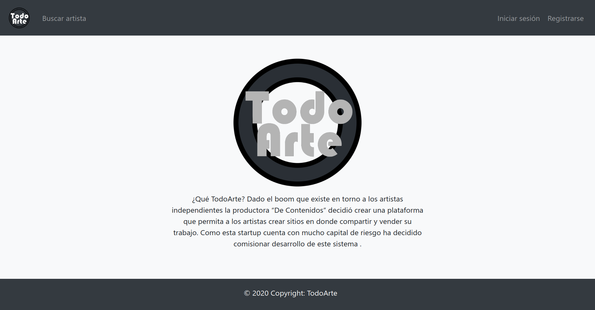
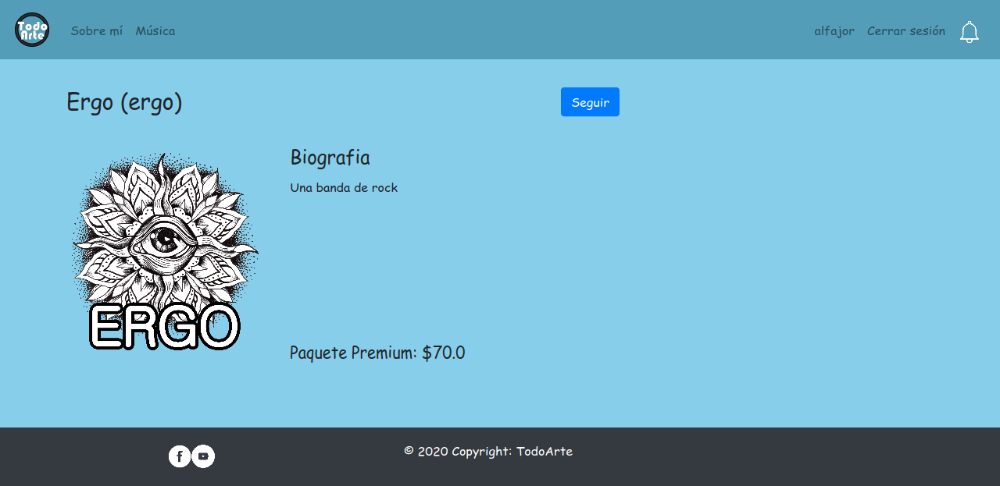
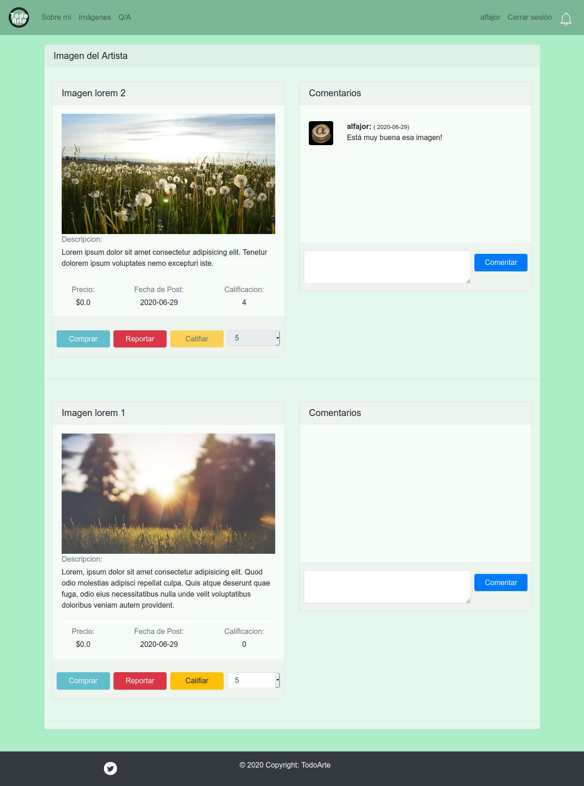
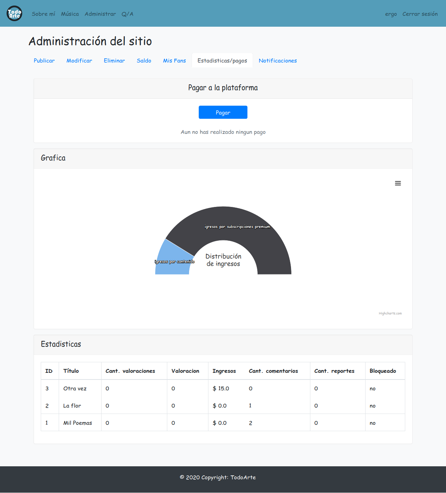

# Taller de Sistemas de Información JAVA

## Trabajo Obligatorio Edición 2020

**Integrantes del equipo:**
+ Carlos Balbiani
+ Lucas Garrido
+ Juan Álvarez
+ Julio Arrieta

-----------------------------------------------------------------

## Índice
- [Taller de Sistemas de Información JAVA](#taller-de-sistemas-de-información-java)
	- [Trabajo Obligatorio Edición 2020](#trabajo-obligatorio-edición-2020)
	- [Índice](#índice)
	- [Introducción](#introducción)
	- [Funcionalidades](#funcionalidades)
		- [Backoffice](#backoffice)
			- [Administradores](#administradores)
		- [Frontoffice](#frontoffice)
			- [Artistas](#artistas)
			- [Fans](#fans)
			- [Invitados](#invitados)
	- [Requerimientos Opcionales](#requerimientos-opcionales)
	- [Capturas](#capturas)
		- [Inicio](#inicio)
		- [Información de un artista](#información-de-un-artista)
		- [Imágenes de un artista](#imágenes-de-un-artista)
		- [Estadísticas del sitio de un artista](#estadísticas-del-sitio-de-un-artista)

-----------------------------------------------------------------

## Introducción
Dado el boom que existe en torno a los artistas independientes la productora “De Contenidos” decidió crear una plataforma que permita a los artistas crear sitios en donde compartir y vender su trabajo.

Se debe buscar que la plataforma tenga un diseño que tome sentido en cualquier de los escenarios de uso que se dan en el mundo real. Con el avance de las tecnologías y en particular las diferentes formas de acceso a la información (sitios web, app móviles, etc) la plataforma busca centralizar el trabajo de los artistas permitiendo que sus trabajos sean accesibles desde cualquier dispositivo de la misma forma. La ventaja de esto es tener una plataforma totalmente independiente del tipo de dispositivo.

En este marco, la productora “De Contenidos” se propone desarrollar una plataforma genérica de contenidos multimedia para servir a múltiples artistas (video, imágenes, comics, música, etc) que deseen hacer uso de la misma. Como esta startup cuenta con mucho capital de riesgo y pocas capacidades de programación ha decidido comisionar el diseño y desarrollo de este sistema, de nombre código “TodoArte”, a una pujante empresa Uruguaya de desarrollo de software.

La plataforma ofrecerá a los usuarios la posibilidad de buscar mediante categorías de sitios de diferentes artistas. Posteriormente los usuarios podrán registrase en los sitios de los artistas y convertirse en ​fan​ del artista.

Se busca que la plataforma a desarrollar permita a los artistas gestionar sus trabajos así como también comercializar y/o ofrecer accesos premium al contenido a quienes sean parte de su fanbase. Esto permite que los artistas puedan obtener ganancias por su trabajo. La plataforma cobrará a los artistas un monto base mensual por mantener el sitio, así como un 10% de las ganancias obtenidas por usuarios premium y un 5% de las ganancias por la venta de contenido.

Para los artistas es importante saber la opinión de su fanbase, por lo que la plataforma debe permitir que el contenido sea calificado y que los usuarios (fans) puedan publicar comentarios. Continuando con la relación del artista con la fanbase, la plataforma brinda la posibilidad de generar Q&A (preguntas y respuestas) con integrantes de la fanbase. Para evitar comportamiento molesto u ofensivo por parte de un fan, los artistas podrán bloquearlo de su sitio.

A su vez, con el objetivo de mantener la plataforma como un lugar donde predomine el respeto y la tolerancia los administradores de la plataforma podrán eliminar contenido, notificar a los artistas de la eliminaciones y bloquear/desbloquear artistas y sitios.

Dado que esta plataforma va a ser utilizada por artistas que se dedican diferentes expresiones del arte, que pueden ser historietas, pinturas, videos, fotos entre otros, es necesario que el sistema se pueda adaptar los distintos tipos de datos que debe almacenar sin que esto involucre un cambio en el diseño, compilación, o incluso una nueva distribución del sistema. Y que permita clasificar en diferentes categorías el contenido. Por otro lado, teniendo en cuenta que se espera escalar agresivamente, el proceso de registro para un artista que se propone generar un sitio debe ser totalmente automático.

Como “TodoArte” va a actuar como plataforma de base, sobre la cual van a montar su negocio virtual múltiples artistas, es de sumo interés que cada uno de estos sitios pueda contar con un alto grado de personalización en la interfaz de usuario. O sea, desde la perspectiva del usuario final, cada uno de estas instancias debe lucir como un sitio web diferente, alineado a la estética del artista. Esto implica: potencialmente una URL diferente, contenidos específicos, una estética distinta, sin verse afectado por los otros artistas de la plataforma.

El sistema deberá contar con dos módulos. Por un lado el ​backoffice​ para administración general de la plataforma. Es decir que permita tanto la administración de sitios y artistas así como las configuraciones del sistema (gestión de categorías, gestión de usuarios). Y por otro lado un ​frontiffice​ que permita a los usuarios (artistas y fans) acceder al contenido. Todas las funcionalidades del ​frontoffice​ se tienen que poder acceder desde cualquier dispositivo.

-----------------------------------------------------------------

## Funcionalidades

### Backoffice
El backoffice será utilizados por los usuarios administradores de la plataforma quienes deberán estar logeados al sistema. 

#### Administradores
Estos podrán:
+ Bloquear/Desbloquear artistas.
+ Revisar contenido reportado.
+ Bloquear contenido.
+ Notificar a los artistas.
+ Obtener información sobre pagos.
+ Definir categorias.

### Frontoffice
El frontoffice será utilizados por los artistas, fans (usuarios registrados) e invitados.

#### Artistas
Los artistas podrán:
+ Registrarse y loguearse en la plataforma.
+ Publicar, modificar y eliminar contenido.
+ Programar y participar de Q&As.
+ Consultar y recargar su saldo. (mediante tarjeta de crédito o Paypal).
+ Obtener estadísticas de los contenidos publicados.
+ Consultar información de sus fans (ubicación, sexo, gustos).
+ Bloquear/Desbloquear fans.

#### Fans
Los fans podrán:
+ Loguearse en el sitio de un artista.
+ Suscribirse y acceder a los Q&A.
+ Calificar los contenidos.
+ Comentar en los contenidos.
+ Recibir notificaciones.
+ Comprar contenidos y paquetes premium.
+ Buscar artistas.
+ Reportar contenido.

#### Invitados
Los invitados:
+ Podrán ver contenido que sea público
+ Registrarse.
+ Buscar artistas.

## Requerimientos Opcionales
+ ​Inicio​ ​de​ ​sesión​ ​utilizando​ ​redes​ ​sociales.
+ ​Pago​ ​de​ ​productos ​con​ ​medios​ ​de​ ​pago​ ​como​ ​Paypal.
+ Utilización de una base de datos NoSQL (por ej: MongoDB) para la persistencia de​ ​una​ ​parte​ ​de​ ​los​ ​datos​ ​del​ ​sistema.
+ ​Cubrimiento​ ​de​ ​al​ ​menos​ ​80%​ ​de​ ​la​ ​aplicación​ ​con​ ​test​ ​automatizados con Junit.

-----------------------------------------------------------------

## Capturas
### Inicio

### Información de un artista

### Imágenes de un artista

### Estadísticas del sitio de un artista

